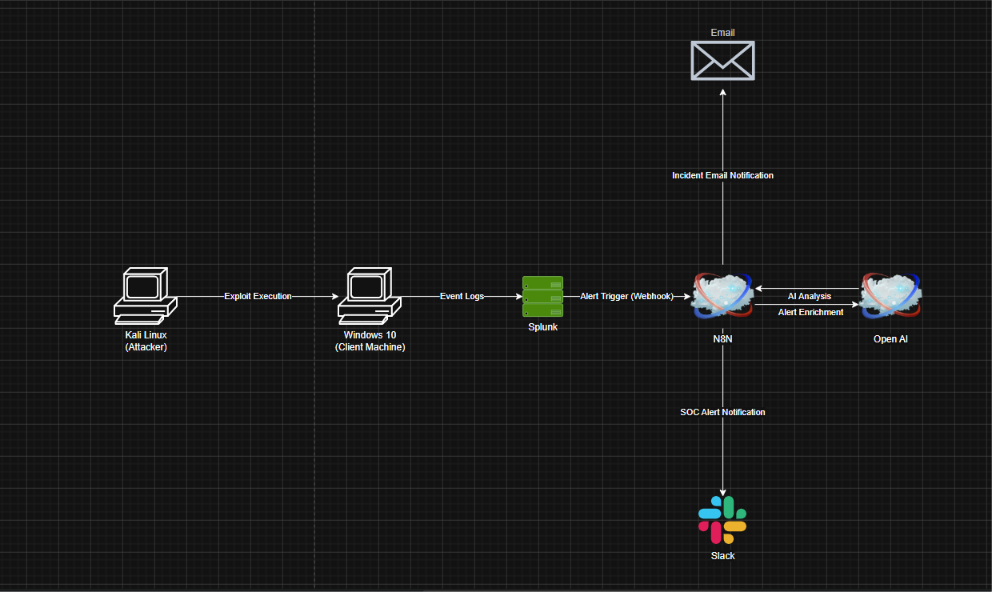
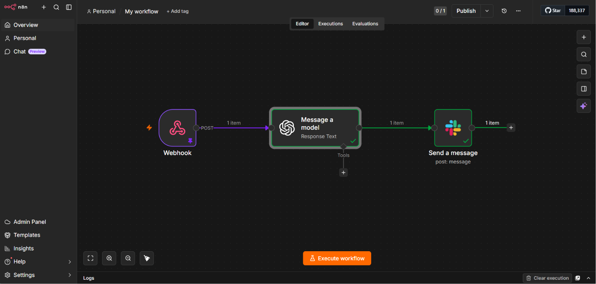

# Splunk-n8n-OpenAI-SOC-Automation

## Project Overview

This project demonstrates an AI-assisted SOC (Security Operations Center) automation pipeline built using Splunk, n8n, OpenAI, and Slack. The goal of the project is to simulate a modern blue-team security monitoring workflow where security alerts are automatically detected, enriched with AI-generated analysis, and delivered to SOC analysts through automated notifications.

The project simulates attack activity from a Kali Linux attacker machine against a Windows 10 client system. Security-related event logs are generated on the Windows machine and collected by Splunk SIEM for monitoring and analysis.

When suspicious activity is detected, Splunk triggers a webhook alert that sends the event data to an n8n automation workflow. The workflow then uses OpenAI to perform AI-based incident enrichment and generate a SOC-style security analysis report. Finally, the enriched alert is delivered to Slack for SOC monitoring and incident response purposes.

This project showcases the integration of SIEM, workflow automation, AI-powered security analysis, and real-time alerting within a blue-team cybersecurity environment.

---

# Architecture Diagram

---

# n8n Workflow

---

# Project Workflow

The project workflow follows the complete lifecycle of a security incident detection and response pipeline:

1. Attack activity is simulated from a Kali Linux machine.
2. Security events are generated on the Windows 10 client machine.
3. Splunk SIEM collects and analyzes Windows event logs.
4. Detection rules in Splunk identify suspicious or malicious activity.
5. Splunk triggers a webhook alert to n8n.
6. n8n receives the alert payload and processes the event data.
7. OpenAI performs AI-based incident analysis and alert enrichment.
8. The enriched SOC alert is automatically sent to Slack notifications.
9. Security analysts can review the alert and perform further investigation.

---

# Technologies Used

## Security & Monitoring
- Splunk Enterprise
- Windows Event Logs
- Kali Linux

## Automation & Integration
- n8n Workflow Automation
- Webhooks
- Slack API

## AI & Analysis
- OpenAI API
- AI-powered SOC alert enrichment

## Infrastructure
- Google Cloud Platform (GCP)

---

# Key Features

- Automated SIEM alert generation using Splunk
- Webhook-based SOC automation workflows
- AI-assisted incident analysis using OpenAI
- Real-time Slack security notifications
- Simulated attack and detection environment
- End-to-end blue-team workflow automation
- Security event enrichment and alert triage
- SOC analyst style reporting pipeline

---

# Security Use Cases Demonstrated

This project demonstrates several important SOC and blue-team cybersecurity concepts, including:

- Security monitoring
- Incident detection
- Alert enrichment
- Security workflow automation
- SIEM integrations
- AI-assisted SOC operations
- Threat detection pipelines
- Security orchestration concepts
- Blue-team incident response workflows

---

# Skills Demonstrated

Through this project, the following cybersecurity and technical skills were demonstrated:

- SIEM Engineering
- SOC Automation
- Blue Team Operations
- Detection Engineering
- Incident Response Workflow Design
- Webhook/API Integration
- AI Integration in Cybersecurity
- Security Monitoring
- Workflow Orchestration
- Cloud-based Security Lab Deployment

---

# Workflow Architecture

Kali Linux → Windows Event Logs → Splunk SIEM → n8n Automation → OpenAI Analysis → Slack Notifications

---

# Future Improvements

Future enhancements planned for this project include:

- Sysmon integration for advanced telemetry
- MITRE ATT&CK framework mapping
- Real-time IOC enrichment
- Email-based incident notifications
- Automated SOAR playbooks
- Threat intelligence integration
- Advanced Splunk detection rules
- Dashboard and analytics integration
- Multi-alert correlation engine
- Automated incident ticket creation

---

# Conclusion

This project demonstrates how AI can be integrated into SOC workflows to automate security alert analysis, enrichment, and incident notification processes. By combining Splunk SIEM, n8n automation, OpenAI analysis, and Slack integration, the project provides a practical example of modern AI-assisted blue-team security operations and SOC automation pipelines.
